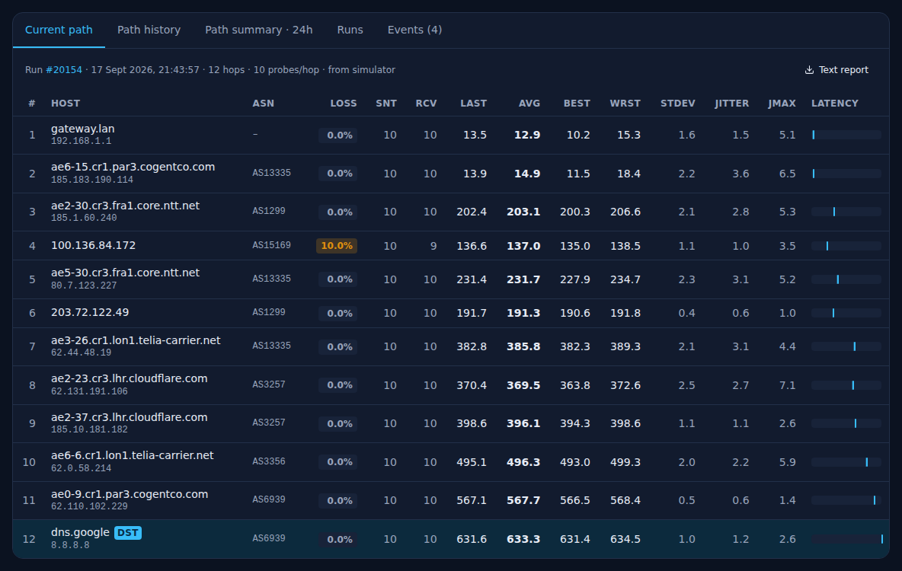
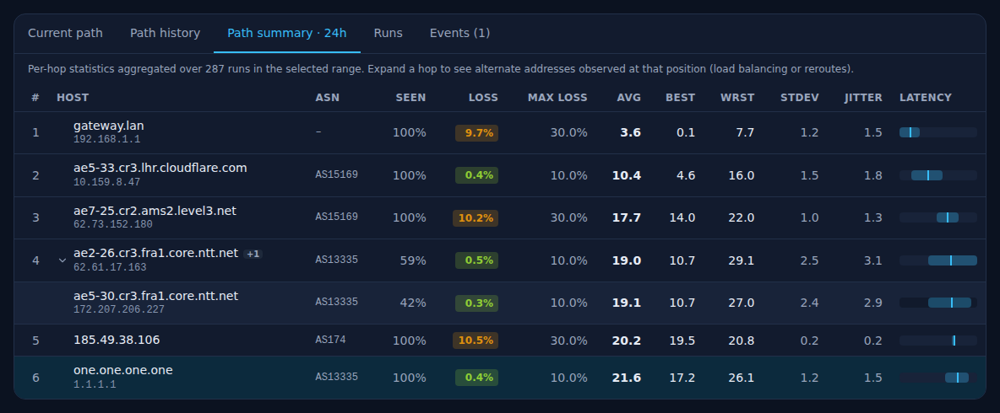
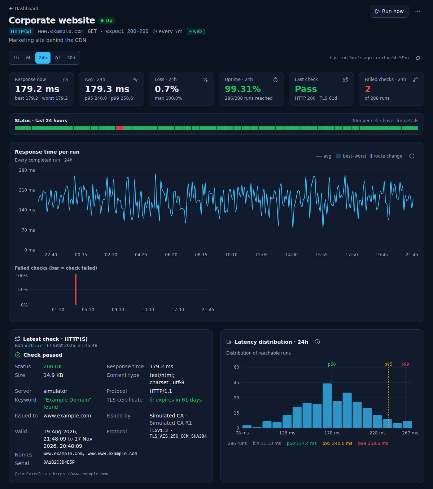
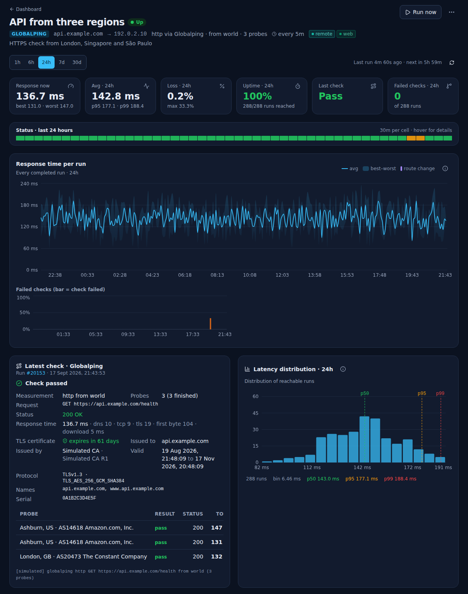
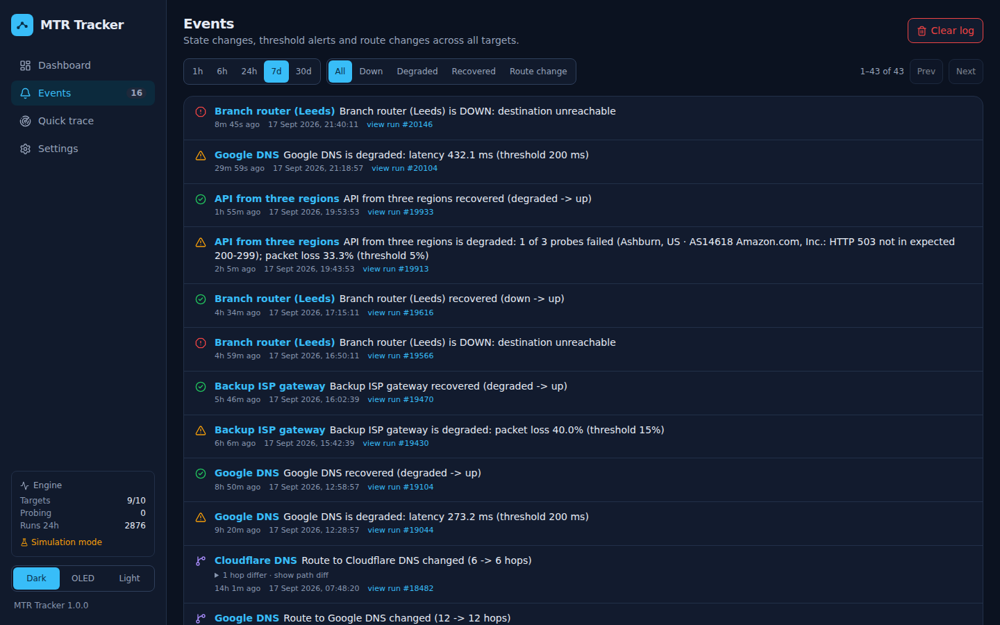

# MTR Tracker

**Continuous MTR monitoring for IT professionals.** MTR Tracker runs `mtr` against the hosts you care about on a schedule you choose, stores every hop of every run, and gives you a clean web UI to see exactly where latency, packet loss and route changes happen over time.

Think of it as SmokePing or Uptime Kuma, but built around the full MTR path rather than a single ping.

The dashboard shows target health first, followed by the **Latency across targets** comparison chart above the filters and target list. Target pages show charts and detailed data together: **Current path**, **Path history**, **Path summary**, **Runs** and **Events** sit below the charts for local MTR and Globalping MTR/traceroute targets. Other probes offer **Runs** and **Events**. Hop tables show all original metrics by default.

See the [interface guide](docs/interface.md) for the current navigation, target actions, chart legends and phone controls, and the [screenshot gallery](docs/screenshots.md) for every capture below plus the light and OLED themes, the table view, the target form and the phone layout.

## Screenshots

All captures show the current interface running in simulation mode with a week of seeded history.

**Dashboard**: health summary, the latency comparison chart and target cards with sparkline, 24-hour status timeline, schedule and tags.


**Target page**: current and range statistics, the status strip, round-trip time with a route-change marker, the route timeline, packet loss and jitter.


**Path profile, latency distribution and hour-by-day heatmap**, followed by the **Current path** hop table with all fourteen columns.




| Path history | Path summary |
| --- | --- |
|  |  |

**Other probe types**: an HTTP(S) target with the response and certificate details of the latest check, and a Globalping HTTP measurement listing each remote probe.

| HTTP(S) check | Globalping HTTP from three probes |
| --- | --- |
|  |  |

**Events**: state changes, threshold alerts and route changes across all targets, with a path diff for reroutes.



## Features

- **Six probe types**, each on its own schedule (10 seconds to 24 hours):
  - **MTR**: full path trace with configurable probe count, probe interval, packet size, max hops, IPv4/IPv6, ICMP / UDP / TCP with a port.
  - **Ping**: ICMP echo to the destination only; loss, avg/best/worst, jitter and per-ping samples.
  - **HTTP(S)**: any method, expected status codes, keyword present or absent, JSON path check (`data.items[0].status` equals, `>= 5`, `~substring`), custom headers and body, redirects, TLS verification, a warning before the certificate expires, and the certificate itself (issuer, subject, validity, alternative names, negotiated protocol) recorded with every run.
  - **TCP port**: connect time to host:port.
  - **DNS**: record type, optional resolver, expected answer, lookup time. A **random subdomain** option queries a fresh label under the name on every run. With this option enabled and no expected answer set, NXDOMAIN or an empty answer counts as a successful lookup.
  - **Globalping**: any of the five [globalping.io](https://globalping.io) measurements, ping, traceroute, MTR, DNS or HTTP, run from a remote probe. Pick a country, city, continent, ASN, network or cloud region. A remote MTR or traceroute uses one probe and is stored like a local path run, so every path visual works for that vantage point. Ping, DNS and HTTP can use up to ten probes at once, with aggregated results and each probe listed; partial DNS/HTTP failures make the target degraded. HTTP measurements include timing and certificate details returned by the remote probe. Configure an optional API token under **Settings** for authenticated Globalping requests; service rate limits apply.
- **Every hop, every run.** Loss %, sent/received, last/avg/best/worst, standard deviation, jitter (Jttr, Javg, Jmax, Jint), ASN and reverse DNS are stored when provided by the probe. Open a run to inspect its hops or export a text report.
- **Health-first dashboard.** Counts of up, degraded, down, paused and pending targets, mean latency and 24-hour route changes. Filter targets by name, host, description or tag, choose **Cards** or **Table**, and sort by status, name, latency, loss or hop count.
- **Time-series views.** Round-trip time with best–worst band, packet loss and jitter charts over 1h to 30d, automatically aggregated for long ranges. Click a point to open the underlying run.
- **Status timeline** on every dashboard card and target page: 48 half-hour cells for the last 24 h coloured up / degraded / down, Uptime Kuma style.
- **Latency across targets**: a collapsible 24-hour chart near the top of the dashboard, above the filters and target list. Toggle individual series through the legend to compare targets; labels distinguish round-trip latency, HTTP response time, TCP connect time and DNS lookup time elsewhere in the UI.
- **Path profile**: latency and loss per hop for the latest run or averaged over the range, showing exactly where delay is added along the path.
- **Latency distribution** histogram with p50 / p95 / p99 markers, and an **hour-by-day heatmap** of latency, loss or jitter that exposes recurring congestion.
- **Route timeline**: which distinct path was in use when, with share and hop count per route, one click from any segment to its run.
- **Path history heatmap.** Hop-by-run grid coloured by loss, latency or jitter, with numeric legends. Latency and jitter use a sequential scale; no response and no data are identified separately.
- **Detailed hop tables.** See full hostnames and IP addresses, ASN, loss, sent/received counts, last/average/best/worst latency, standard deviation, average/maximum jitter and latency bars immediately. Tables show their full height and scroll horizontally on narrow screens.
- **Path summary.** Per-hop statistics aggregated over the selected range, including alternate addresses seen at each hop (ECMP or reroutes) with how often each was observed.
- **Path map** (optional, [MaxMind GeoLite2](https://www.maxmind.com/en/geolite2/signup)). Save a free MaxMind licence key under **Settings** and every target page gains a map of the monitoring server, every located hop and the destination, joined in path order. The server downloads the GeoLite2 City database with your key, keeps it in the data directory and refreshes it weekly. Private hops and addresses missing from the database are listed under the map; Globalping probes are placed where they report themselves.
- **Route change detection** with a hop-by-hop diff, and detection of destination IP changes for DNS-based targets.
- **Alerting.** Per-target loss and latency thresholds produce up / degraded / down state transitions, an event log, and notifications via **Pushover** and generic JSON **webhooks** (n8n, Zapier, custom receivers), each with its own event selection and a one-click test.
- **Tags** to group and filter targets, always sorted alphabetically, each with an automatic colour that can be replaced by a preset or a custom colour (from the target form or under Settings). A colour applies everywhere the tag is used.
- **Target actions.** **Run now** stays visible; the three-dot menu contains **Pause/Resume**, **Edit**, **Clone** and **Delete**. Cloning opens a form with every setting of the original and a "(copy)" name, ready to adjust before the new target is created.
- **Quick trace.** Run a one-off MTR from the server without saving it, then add the host as a target in one click.
- **Text report export** of any run in the familiar `mtr --report` layout.
- **Retention** control, SQLite storage (WAL mode), dark, true-black OLED and light themes, responsive layout for phones and wall displays.
- **Simulation mode** to demo or develop without raw-socket privileges.

## Quick start (Docker)

```bash
git clone https://github.com/smf13/MTR-test.git mtr-tracker
cd mtr-tracker
docker compose up -d --build
```

Open <http://localhost:8899>, click **Add target**, enter a host and an interval, and the first run starts immediately.

Data lives in the `mtr-tracker-data` volume (`/data` inside the container). The process runs as an unprivileged user (uid 1000): `mtr-packet` and `ping` carry the `cap_net_raw` file capability, so raw sockets work without root as long as `NET_RAW` is in the container's capability set (Docker's default, and `docker-compose.yml` grants it explicitly). At start the entrypoint changes the owner of `/data` to that user, which also applies to a bind-mounted host directory. Uncomment `network_mode: host` if you want the first hop to be your host's real gateway instead of the Docker bridge.

mtr only accepts probe intervals below one second when it runs as root, so such intervals are raised to 1 s in the container. Set `MTR_TRACKER_RUN_AS_ROOT=1` to keep the process as root if you need them.

### Updating an existing Docker installation

From your existing checkout, pull the latest `main` and rebuild the image:

```bash
git switch main
git pull --ff-only origin main
docker compose up -d --build
```

The existing data volume is reused. Reload the browser after the container starts to load the rebuilt interface. Configuration and monitoring history remain in the volume; do not use `docker compose down -v` unless you intend to delete that data.

### Configuration

Environment variables (read at startup):

| Variable | Default | Purpose |
| --- | --- | --- |
| `MTR_TRACKER_HOST` | `0.0.0.0` | Bind address when starting with `python -m app.main` (including Docker) |
| `MTR_TRACKER_PORT` | `8899` | HTTP port when starting with `python -m app.main` (including Docker) |
| `MTR_TRACKER_DATA_DIR` | `./data` (`/data` in the image) | Directory for the SQLite database |
| `MTR_TRACKER_DB_PATH` | `<data directory>/mtr-tracker.db` | Override the SQLite file location; the process must be able to create/write its parent directory |
| `MTR_TRACKER_STATIC_DIR` | Auto-detect `frontend/dist` (`/app/static` in the image) | Directory containing the built web UI; without a build, only the API is served |
| `MTR_TRACKER_MAX_CONCURRENT_RUNS` | `8` | Maximum simultaneous scheduled or Run now jobs across all probe types; quick traces have a separate limit |
| `MTR_TRACKER_MTR_BINARY` | `mtr` | Path to the mtr binary |
| `MTR_TRACKER_SIMULATE` | `0` | `1` generates synthetic probe results; hostname resolution and notifications can still use the network |
| `MTR_TRACKER_LOG_LEVEL` | `info` | Log verbosity |
| `MTR_TRACKER_API_TOKEN` | empty | When set, all write requests need `Authorization: Bearer <token>`, and reads of the settings show credentials masked unless they carry it |
| `MTR_TRACKER_RUN_AS_ROOT` | `0` | Docker only: `1` keeps the process as root (needed for mtr probe intervals below 1 s) |

Everything else (retention days, reverse DNS, ASN lookup, notification channels, public URL, tag colours, the Globalping token, the MaxMind credentials) is set in the UI under **Settings** and stored in the database.

The supplied Compose file publishes `8899:8899`. To change only the externally exposed port, change the left-hand value, for example `8080:8899`. If you change `MTR_TRACKER_PORT` inside the container, also update the right-hand value. When using the `uvicorn` development command below, its `--host` and `--port` arguments control the listener instead.

### Notifications

Two channels can be enabled independently under **Settings**, each with its own set of events (`down`, `recovered`, `degraded`, `route_change`) and a **Send test** button that uses the values currently in the form.

**Pushover**: enter your user or group key and an application API token (create one at pushover.net/apps/build). Optional device and sound, and a priority that is either fixed or *Auto* (down = high, degraded and recovered = normal, route change = low). Emergency priority repeats every 60 s for 30 min until acknowledged. Set the **Public URL** so each push carries an "Open in MTR Tracker" link to the affected target.

**Webhook**: a JSON POST to any URL.

### Webhook payload

```json
{
  "source": "MTR Tracker",
  "event": "down",
  "severity": "critical",
  "message": "Head office WAN is DOWN: destination unreachable",
  "target": { "id": 3, "name": "Head office WAN", "host": "203.0.113.1" },
  "run_id": 1842,
  "details": { "previous": "up", "current": "down", "loss_pct": 100.0 },
  "url": "https://mtr.example.com/targets/3",
  "timestamp": 1758000000.0
}
```

Event kinds: `down`, `recovered`, `degraded`, `route_change`. `url` is present when a public URL is configured.

### Path map (MaxMind GeoLite2)

1. Create a free GeoLite2 account at maxmind.com and generate a licence key (**Account → Manage License Keys**).
2. Under **Settings → MaxMind GeoIP**, paste the licence key (and, optionally, your numeric account ID, which switches the download to MaxMind's current authenticated endpoint) and save.
3. The server downloads the GeoLite2 City database into `<data directory>/geoip/` in the background; **Download now** fetches it immediately and reports any credential error. The database is refreshed once a week by the hourly maintenance tick and is never bundled with the image, as MaxMind's licence requires.

With the key saved, each target page shows a **Path map** (or **Location map** for ping, HTTP, TCP and DNS targets). The monitoring server is placed by its own address, or, when it sits behind NAT, by the public address it is seen from (looked up once an hour through `api.ipify.org`, with `checkip.amazonaws.com` as fallback). Hops with private addresses and addresses missing from the database are listed under the map instead of being drawn. Map tiles come from OpenStreetMap, so browsers need to reach `tile.openstreetmap.org`. In simulation mode no database is downloaded and the locations are synthetic. Leave the key empty to hide the map again.

### Troubleshooting

- **`WARN current commit information was not captured by the build`** during `docker compose up --build`: harmless. BuildKit tries to embed git metadata in the image and could not run `git rev-parse` in the build directory (not a git checkout, git not installed, or git refuses the directory owner). Silence it with `BUILDX_GIT_INFO=0 docker compose up -d --build`, or fix the ownership case with `git config --global --add safe.directory /path/to/mtr-tracker`.
- **Every hop shows 100% loss** in live mode: check the run error and container logs for probe failures, and check whether the destination or network blocks the selected protocol. Permission errors require `cap_add: [NET_RAW]` and the `cap_net_raw` file capability on `mtr-packet`; host networking does not replace these permissions.
- **First hop is `172.x.x.x`** instead of your gateway: that is the Docker bridge. Use `network_mode: host` to probe from the host's network stack.
- **`mtr binary not found`** in Settings: the image ships `mtr-tiny`; outside Docker install it (`apt install mtr-tiny`) or set `MTR_TRACKER_MTR_BINARY`. Local MTR falls back to synthetic results if its binary is missing; local ping does the same when `ping` is missing. Other probe types do not switch to simulation just because mtr is absent.
- **The page looks like the earlier interface after an update**: rebuild the Docker image and reload the page. For a source installation, run `npm run build` in `frontend`, then restart the backend if it started before that build existed.
- **A probe interval below 1 s runs at 1 s**: mtr refuses shorter intervals for non-root users. Run as root (`MTR_TRACKER_RUN_AS_ROOT=1` in Docker) if you need them; `/api/status` reports the effective minimum as `min_probe_interval`.
- **Slow API right after lowering the retention**: the hourly purge deletes in batches of 5000 runs and yields between them, so the UI stays responsive, but a very large backlog still takes a while to disappear.

## Managing targets from the API

The UI is a thin client over a JSON API, so anything you do by hand can be scripted. Interactive docs with every schema live at `/api/docs`.

Set `MTR_TRACKER_API_TOKEN` on the server to require `Authorization: Bearer <token>` (or `X-Api-Token`) on `/api/` requests using `POST`, `PUT`, `PATCH` or `DELETE`. Reads stay open so dashboards and wall displays work without credentials, but with a token set, `GET /api/settings` masks the Pushover credentials, Globalping token and the path/query of the webhook URL unless the request carries the token, and `GET /api/status` omits the database path. A masked value sent back in a `PUT` leaves the stored one untouched. When a token is set, the UI prompts after an unauthorized write and keeps the token in this browser; save it and retry the action, or enter it under **Settings → API access**.

`POST /api/probe` (quick trace) runs at most two traces at a time; further requests wait up to 30 s and then get `429`.

```bash
BASE=http://localhost:8899
AUTH="Authorization: Bearer $MTR_TRACKER_API_TOKEN"   # omit if no token is configured

# List targets with latest run, 24h stats, sparkline and status timeline
curl -s $BASE/api/targets | jq '.[] | {id, name, type, last_status}'

# MTR target
curl -s -X POST $BASE/api/targets -H "$AUTH" -H 'content-type: application/json' -d '{
  "name": "Head office WAN", "host": "203.0.113.1", "type": "mtr",
  "interval_sec": 60, "count": 10, "alert_loss_pct": 5, "alert_latency_ms": 150, "tags": ["wan"]
}'

# Ping target
curl -s -X POST $BASE/api/targets -H "$AUTH" -H 'content-type: application/json' -d '{
  "name": "Core switch", "host": "10.0.0.1", "type": "ping", "interval_sec": 30, "count": 5
}'

# HTTP target with keyword + JSON + TLS expiry warning
curl -s -X POST $BASE/api/targets -H "$AUTH" -H 'content-type: application/json' -d '{
  "name": "Portal health", "host": "https://portal.example.com/health", "type": "http", "interval_sec": 60,
  "options": { "expected_status": "200", "keyword": "ok", "json_path": "status", "json_expected": "ok",
               "headers": { "Authorization": "Bearer abc" }, "tls_warn_days": 21 }
}'

# TCP port and DNS targets (random_prefix measures the uncached lookup time)
curl -s -X POST $BASE/api/targets -H "$AUTH" -H 'content-type: application/json' \
  -d '{ "name": "Mail submission", "host": "mail.example.com", "type": "tcp", "port": 587, "interval_sec": 60 }'
curl -s -X POST $BASE/api/targets -H "$AUTH" -H 'content-type: application/json' \
  -d '{ "name": "Public DNS", "host": "www.example.com", "type": "dns", "interval_sec": 60,
        "options": { "record_type": "A", "resolver": "1.1.1.1", "expected": "93.184." } }'
curl -s -X POST $BASE/api/targets -H "$AUTH" -H 'content-type: application/json' \
  -d '{ "name": "Resolver, uncached", "host": "example.com", "type": "dns", "interval_sec": 300,
        "options": { "record_type": "A", "resolver": "10.0.0.53", "random_prefix": true } }'

# Globalping: ping from two German probes, the path as seen from AWS Ireland, a DNS lookup from Asia and an HTTPS fetch from three US probes
curl -s -X POST $BASE/api/targets -H "$AUTH" -H 'content-type: application/json' \
  -d '{ "name": "CDN from Germany", "host": "cdn.example.com", "type": "globalping", "interval_sec": 300, "count": 4,
        "options": { "measurement": "ping", "location": "Germany", "probes": 2 } }'
curl -s -X POST $BASE/api/targets -H "$AUTH" -H 'content-type: application/json' \
  -d '{ "name": "Path from AWS eu-west-1", "host": "203.0.113.1", "type": "globalping", "interval_sec": 600, "count": 3,
        "options": { "measurement": "mtr", "location": "aws-eu-west-1" } }'
curl -s -X POST $BASE/api/targets -H "$AUTH" -H 'content-type: application/json' \
  -d '{ "name": "DNS from Asia", "host": "www.example.com", "type": "globalping", "interval_sec": 600,
        "options": { "measurement": "dns", "location": "AS", "probes": 2, "record_type": "A", "resolver": "1.1.1.1", "expected": "93.184." } }'
curl -s -X POST $BASE/api/targets -H "$AUTH" -H 'content-type: application/json' \
  -d '{ "name": "Portal from the US", "host": "portal.example.com", "type": "globalping", "interval_sec": 600,
        "options": { "measurement": "http", "location": "US", "probes": 3, "path": "/health", "expected_status": "200", "keyword": "ok" } }'

# Update (partial), pause, run now, delete
curl -s -X PUT $BASE/api/targets/3 -H "$AUTH" -H 'content-type: application/json' -d '{ "interval_sec": 120 }'
curl -s -X PUT $BASE/api/targets/3 -H "$AUTH" -H 'content-type: application/json' -d '{ "enabled": false }'
curl -s -X POST $BASE/api/targets/3/run -H "$AUTH"
curl -s -X DELETE $BASE/api/targets/3 -H "$AUTH"

# Bulk: pause | resume | run | delete
curl -s -X POST $BASE/api/targets/bulk -H "$AUTH" -H 'content-type: application/json' -d '{ "action": "pause", "ids": [1, 2, 3] }'

# Backup and restore (upsert matches on name; create always adds; replace wipes first)
curl -s $BASE/api/targets/export > targets.json
curl -s -X POST $BASE/api/targets/import -H "$AUTH" -H 'content-type: application/json' \
  -d "{ \"mode\": \"upsert\", \"targets\": $(cat targets.json) }"

# Read results
curl -s "$BASE/api/targets/3/runs?limit=5"
curl -s "$BASE/api/targets/3/series?range=24h"
curl -s "$BASE/api/runs/1842/report"          # mtr-style text
```

Target fields: `name`, `host` (hostname, IP, or URL for http), `type` (`mtr` | `ping` | `http` | `tcp` | `dns` | `globalping`), `options` (per type, see `/api/docs`), `description`, `tags`, `interval_sec`, `count`, `probe_interval`, `protocol`, `port`, `packet_size`, `ip_version`, `max_hops`, `enabled`, `alert_loss_pct`, `alert_latency_ms`. `count` accepts 1–200 for local MTR/ping; Globalping ping/MTR requests clamp the packet count to 16 per probe. Other check types do not use it as a repeat count.

## How a run works

1. The scheduler wakes every second and queues enabled targets whose next run is due, with active runs limited by `MTR_TRACKER_MAX_CONCURRENT_RUNS`. The interval is measured from the start of a run. Runs of the same target never overlap; slow runs or a full concurrency pool can delay the next start. A local MTR run with 10 probes at 1 s takes about 15 s, so keep the interval comfortably above probes × probe interval + 5 s.
2. For a local MTR target, the host is resolved to a single IP (honouring the target's IP version) so the destination hop can be identified unambiguously.
3. `mtr --json -n -c <count> -i <probe interval> -s <size> -m <max hops> -o LSDRNBAWVGJMXI [-4|-6] [--udp|--tcp -P <port>] [-z] <ip>` runs and its JSON report is parsed.
4. Hop IPs are reverse-resolved (cached), the route signature is compared with the previous run that reached the destination (an unreachable run is padded with unknown hops, so comparing across an outage would report a bogus reroute), thresholds are evaluated, and the run and its hops are written in one transaction.
5. Target state changes to `down` or `degraded` create matching events. A return from either state to `up` creates a `recovered` event; `recovered` is an event kind, not a target status. Enabled notification channels receive the event kinds selected in Settings. Deleting a target cancels a run still in flight.

Ping, HTTP, TCP and DNS targets follow the same loop with `probes.py` in place of mtr: one summary row per run plus a `details` object (samples, status code, TLS expiry and certificate, answers) instead of hops. A failed check is `down`; a TLS certificate inside the warning window is `degraded`. Globalping targets (`globalping.py`) create a measurement through the public API and poll it until every probe has reported: ping, DNS and HTTP become a summary row with one entry per probe (DNS and HTTP are pass/fail checks: down when no probe passed, degraded when only some did), while MTR and traceroute become a normal path run whose hops came from the remote probe.

## API

Interactive API documentation is available at `/api/docs`, with the OpenAPI schema at `/api/openapi.json`. Docker checks the unauthenticated `GET /healthz` endpoint for process health.

| Method | Path | Description |
| --- | --- | --- |
| `GET` | `/api/status` | Engine status, counters, mtr version |
| `GET` / `PUT` | `/api/settings` | Global settings |
| `GET` / `POST` | `/api/targets` | List (with 24h stats, sparkline and status timeline) / create |
| `GET` | `/api/tags` | Tags in use with target counts and configured colours (`settings.tag_colors`) |
| `GET` | `/api/targets/export` | Portable target definitions (no runs) |
| `POST` | `/api/targets/import` | Bulk create/update: `{ "mode": "upsert" \| "create" \| "replace", "targets": [...] }` |
| `POST` | `/api/targets/bulk` | `{ "action": "pause" \| "resume" \| "run" \| "delete", "ids": [...] }` |
| `GET` / `PUT` / `DELETE` | `/api/targets/{id}` | Detail with range stats (`?range=24h`) / update / delete |
| `POST` | `/api/targets/{id}/run` | Run now |
| `GET` | `/api/targets/{id}/runs` | Paginated runs (`limit`, `offset`, `range`, `status=ok|failed|route_change`) |
| `GET` | `/api/targets/{id}/series` | Destination latency / loss / jitter time series, auto-bucketed |
| `GET` | `/api/targets/{id}/hops/history` | Hop-by-run matrix for the heatmap |
| `GET` | `/api/targets/{id}/hops/summary` | Per-hop aggregates with alternate addresses |
| `GET` | `/api/targets/{id}/hourly` | Hour buckets (avg, worst, loss, jitter, reached) for the day-by-hour heatmap |
| `GET` | `/api/targets/{id}/routes` | Contiguous route segments over time and per-route share |
| `GET` | `/api/targets/{id}/geo` | Locations of the monitor (or remote probes), hops and destination of the latest completed run; `enabled` is false without a MaxMind key |
| `GET` | `/api/geoip/status` | State of the GeoLite2 database: configured, downloaded, build date, last error |
| `POST` | `/api/geoip/update` | Download the GeoLite2 City database now with the saved MaxMind credentials |
| `GET` | `/api/overview/series` | Bucketed latency and loss for every target, for the comparison chart |
| `GET` | `/api/targets/{id}/events` | Events for one target |
| `GET` | `/api/runs/{id}` | A run with all hops |
| `GET` | `/api/runs/{id}/report` | Plain-text mtr-style report |
| `GET` / `DELETE` | `/api/events` | Global event log (`kind`, `severity`, `target_id`, `range`) |
| `POST` | `/api/probe` | One-off trace, not stored |
| `POST` | `/api/notifications/test` | Send a test through `webhook` or `pushover`, optionally with unsaved settings |

Ranges accept `1h`, `6h`, `24h`, `7d`, `30d` or a number of seconds.

## Development

Run the backend and frontend in separate terminals, starting each set of commands from the repository root. The backend supports Python 3.11+; CI and Docker use Python 3.12. The frontend uses Node.js **22.22.2 or newer in the 22.x line**, which satisfies the checked-in Vite, Vitest and jsdom requirements.

Backend:

```bash
cd backend
python -m venv .venv
source .venv/bin/activate
python -m pip install -r requirements-dev.txt
MTR_TRACKER_SIMULATE=1 MTR_TRACKER_DATA_DIR=./data python -m uvicorn app.main:app --reload --port 8899
```

Frontend:

```bash
cd frontend
npm ci
npm run dev        # http://localhost:5173, proxies /api to :8899
```

Vite also proxies `/healthz`. Set `MTR_TRACKER_API` before starting Vite to use another backend URL, for example `MTR_TRACKER_API=http://127.0.0.1:9000 npm run dev`. This variable affects the development proxy, not a production build.

After installing dependencies, run checks from the repository root in a separate terminal:

```bash
(cd backend && .venv/bin/python -m pytest -q)
(cd frontend && npm test)
(cd frontend && npm run build)
```

`npm run build` runs the TypeScript check and writes `frontend/dist`, which the backend serves when that directory exists at startup. `npm run typecheck` runs only the TypeScript check.

Running real probes outside Docker requires the `mtr` binary (`apt install mtr-tiny`, which gives `mtr-packet` the `cap_net_raw` capability) and `iputils-ping`. Root is only needed for probe intervals below one second.

Simulation produces synthetic measurements, but local MTR/ping/TCP hostname resolution, local MTR reverse DNS and configured notifications can still access the network. For an isolated UI demo, use IP-literal targets, disable reverse DNS and leave notification channels disabled.

- **Backend tests:** `backend/tests`; `conftest.py` provides `client` (open instance), `protected_client` (with an API token) and `static_client` (with a stub frontend build), all built by `helpers.app_client`.
- **Frontend tests:** `frontend/tests`, using Vitest, jsdom and Testing Library. Coverage includes target action menus, keyboard navigation, tab/probe compatibility, all hop metrics, path-summary alternate addresses, run pagination/filtering, help popovers, heatmap legends, dashboard filtering, clone prefill, the path map card (marker grouping, unlocated hops, the Settings pointer) and the MaxMind settings section. API calls and browser-only sizing are mocked; these are component tests, not screenshot tests.
- **CI:** pushes to `main` and pull requests run backend tests plus the frontend production build and component tests. A Docker build runs after both jobs pass; CI does not publish the image.

## Project layout

```
backend/app/
  main.py        FastAPI app, static file serving, lifespan
  api.py         HTTP routes
  scheduler.py   24/7 run loop, state transitions, retention
  mtr.py         mtr command builder, JSON parser, simulator
  probes.py      ping, HTTP, TCP and DNS probes
  globalping.py  Globalping API client: ping, traceroute, MTR, DNS and HTTP
  geoip.py       MaxMind GeoLite2 download, lookups and path geolocation for the map
  notify.py      webhook + Pushover delivery, event fan-out
  resolver.py    forward DNS and cached reverse DNS
  db.py          SQLite schema, transactions, batched retention purge
  models.py      request schemas
  config.py      environment configuration
backend/tests/   pytest API, scheduler and probe regressions
frontend/src/
  pages/         Dashboard, TargetDetail, RunView, Events, Settings, QuickTrace
  components/    charts, heatmaps, tables, forms, tags, Tabs, TargetActions, Popover, Layout
  index.css      theme tokens and shared controls
frontend/tests/  Vitest component interactions with Testing Library
docs/            interface guide and screenshots
.github/workflows/ci.yml  backend tests, frontend build/tests, Docker build
docker-entrypoint.sh  fixes /data ownership as root, then drops to the unprivileged user
```

## License

MIT
