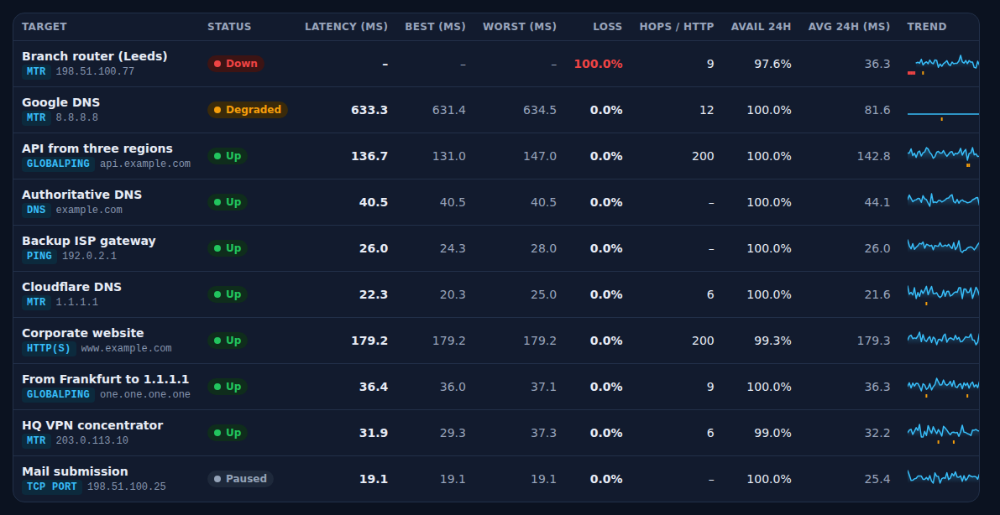
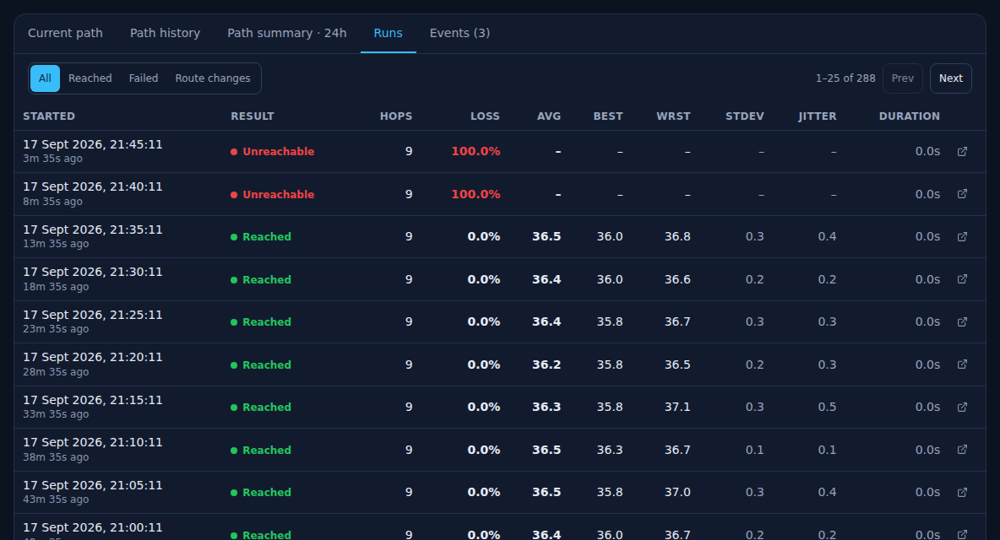
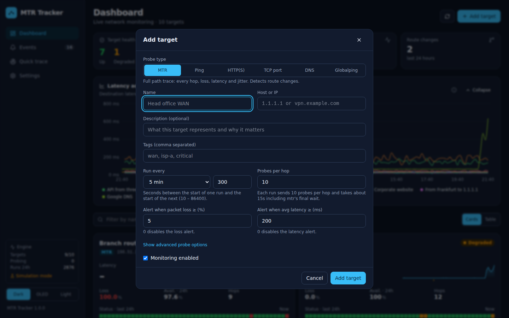
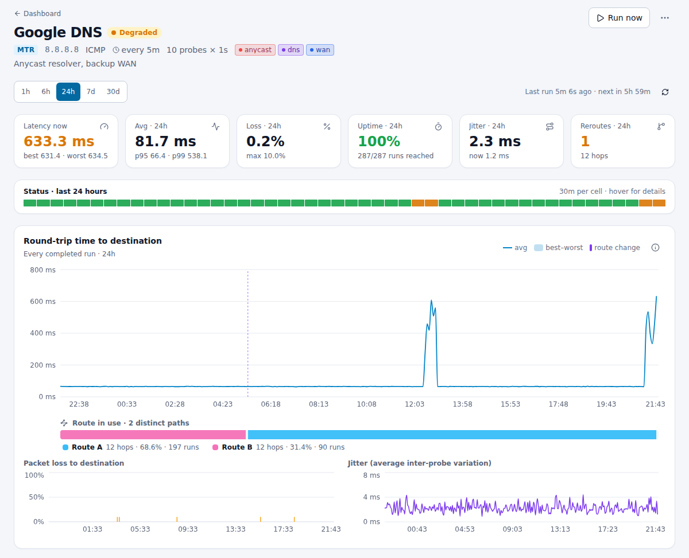
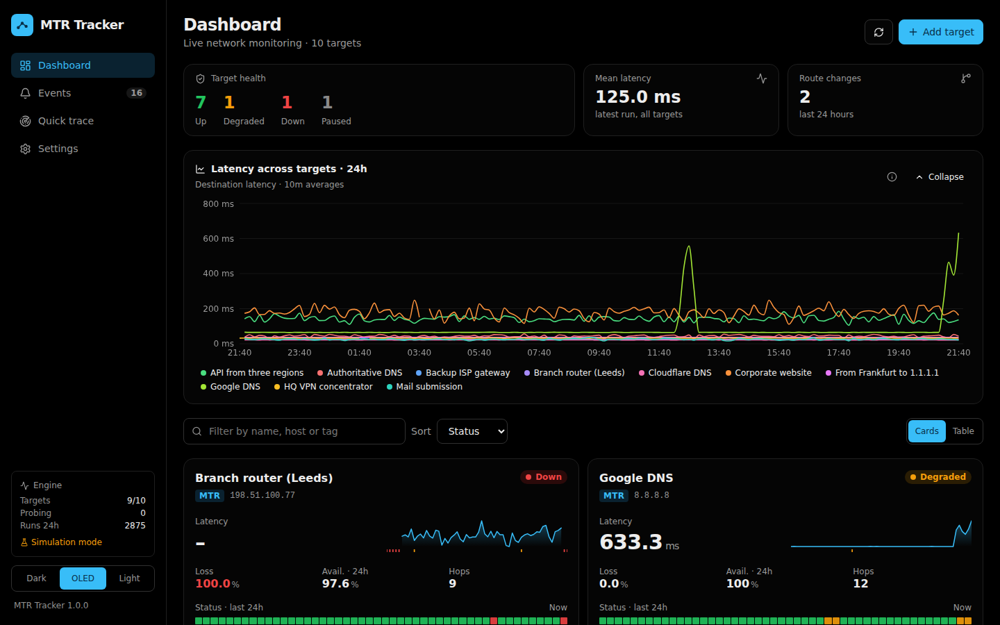
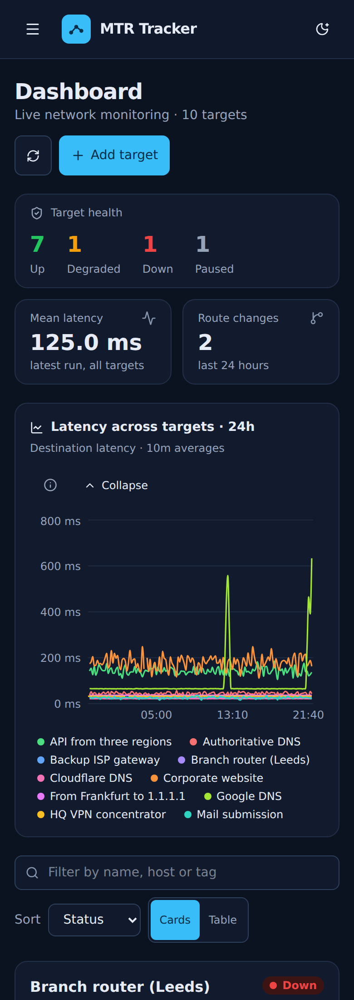
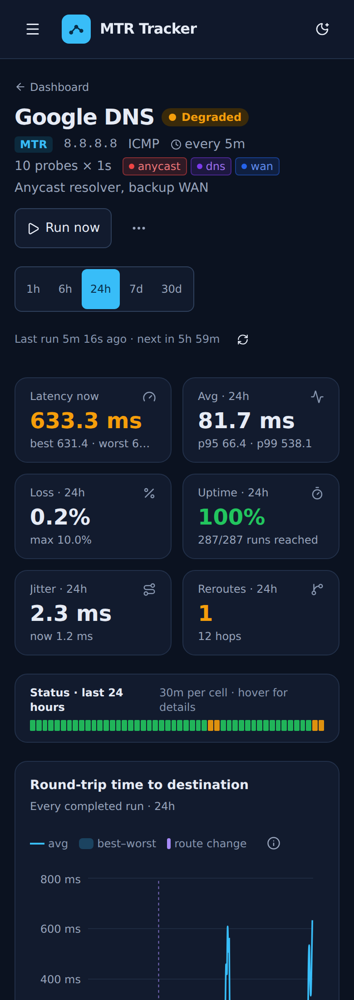

# Interface screenshots

These captures show the current MTR Tracker interface. They were taken with headless Chromium against the application running in simulation mode (`MTR_TRACKER_SIMULATE=1`) with a week of seeded history: ten targets covering every probe type, scripted outages, loss and latency incidents and route changes. Use the [interface guide](interface.md) for navigation and controls, or return to the [README](../README.md).

Desktop captures use a 1440 px wide viewport and the dark theme unless stated otherwise; phone captures use a 390 px wide viewport.

## Dashboard

Health summary, the **Latency across targets** comparison chart, filters and target cards.

The **Table** view of the same targets.

## Target page

Header, range selector, current and range statistics, the 24-hour status strip and the time-series charts. The dashed line on the latency chart marks a route change; the route timeline below it shows which path was in use when.

Path profile, latency distribution with percentile markers and the hour-by-day heatmap.

### Data tabs

**Current path**: the complete hop table of the latest run with all fourteen columns, and the text report download.

**Path history**: one row per hop and one column per run, here coloured by latency. Hot columns are the latency incidents.

**Path summary**: per-hop statistics over the range with an alternate address expanded at hop 4.

**Runs**: paginated run history with result filters. The two most recent runs of this target failed to reach the destination.

## Other probe types

An HTTP(S) target: response time per run, failed checks, the latest response and the certificate recorded with it.

A Globalping HTTP measurement from three remote probes, each listed with its result.

## Events and target form

## Themes

Light theme on a target page and the OLED (true black) theme on the dashboard.

## Phone layout

| Dashboard | Target page |
| --- | --- |
|  |  |

## Regenerating these captures

1. Build the frontend (`npm run build` in `frontend/`) and start the backend in simulation mode with an empty data directory, using IP-literal or fictional hosts, reverse DNS disabled and notification channels disabled.
2. Seed history rather than waiting for it: call `Scheduler._execute` for each target at backdated timestamps (patch `time.time`), so the rows are exactly what the scheduler writes. Park `next_run_at` in the future afterwards so the live scheduler does not add runs while capturing.
3. Capture with headless Chromium (Playwright) at 1440 px wide, clipping each section to its card, and again at 390 px wide for the phone layout. Move the pointer away from charts before capturing so no tooltip is open.
4. Include the dashboard, a target page with the full Current path table, Path history, Path summary with alternate addresses expanded, Runs, a non-path probe, the events page and all three themes. Check each image against the current interface before replacing the files.
