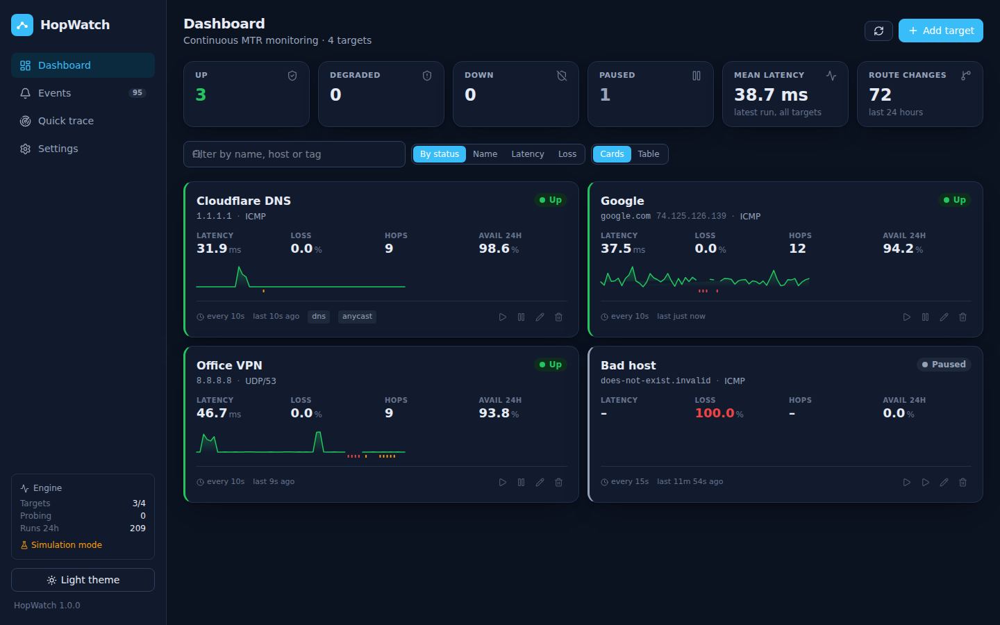
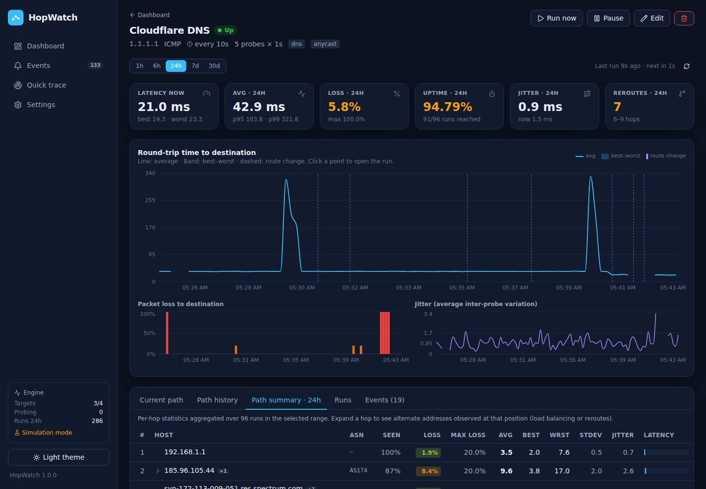
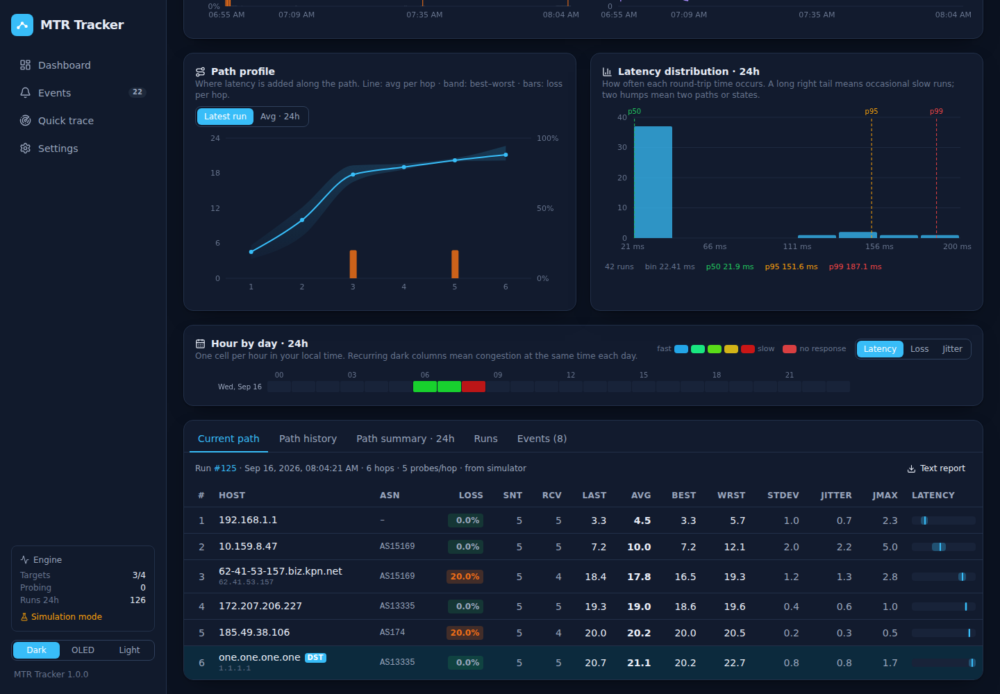
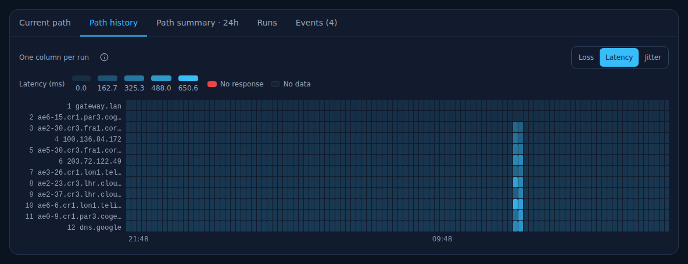
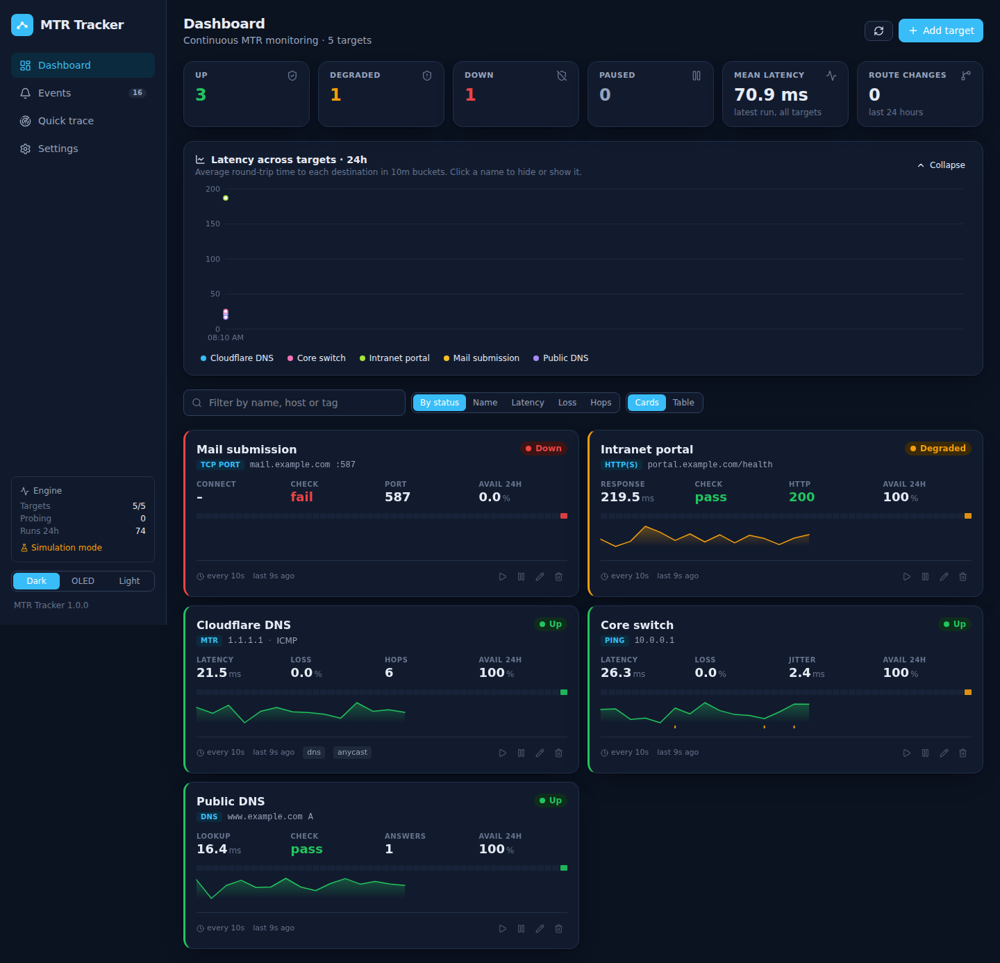

# Archived interface screenshots

These screenshots predate the GUI refresh in [commit 1067993](https://github.com/smf13/MTR-test/commit/106799350e718baffc9050db8af92a1d3c2e1f8b). They are historical references, not screenshots of the current interface. Use the [interface guide](interface.md) for current navigation and controls, or return to the [README](../README.md).

The original detailed hop tables and combined data tabs below the target charts have been restored. The current dashboard still puts target cards/table above the comparison chart, uses a three-dot menu for secondary target actions and has updated styling. Those changes are not reflected in the captures below.

## Dashboard before the refresh

## Target detail before the refresh

## Path history before the refresh

## Probe types before the refresh

## Replacing these captures

Capture the running application in simulation mode, using IP-literal targets, reverse DNS disabled and notification channels disabled. Include the dashboard, target charts with the full Current path table, Path history, Path summary with alternate addresses expanded, Runs and a non-path probe. Check desktop and narrow layouts and all three themes. Replace the PNGs and remove the archive wording only after checking that each image matches the current interface.
